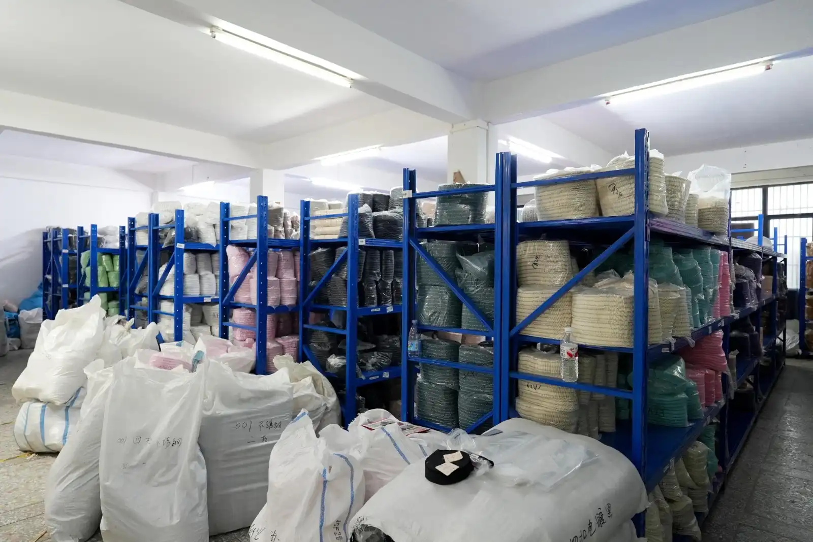
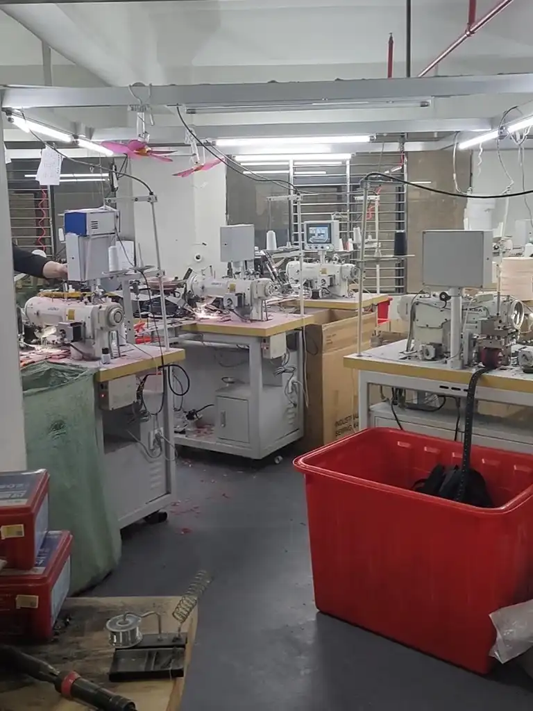
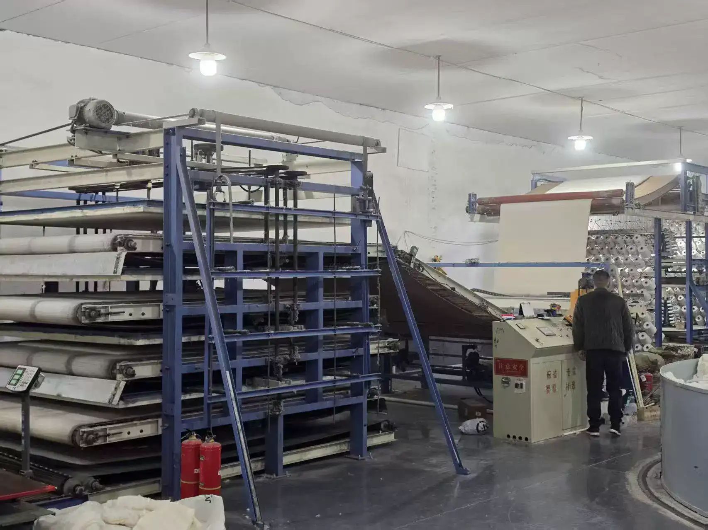
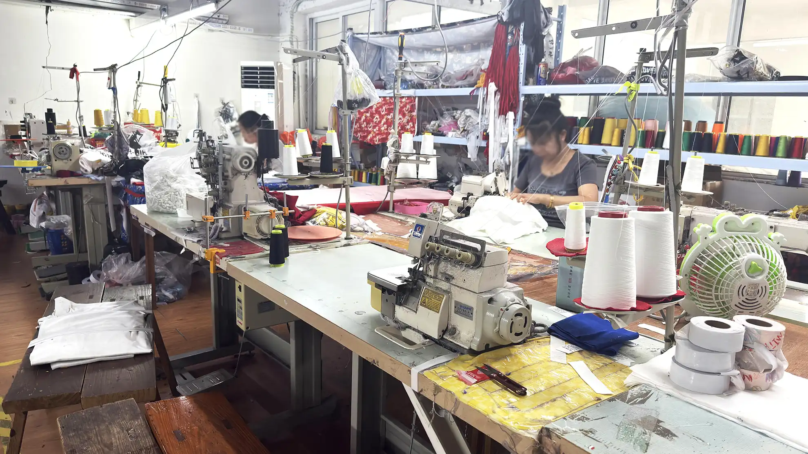

# Custom Apparel Manufacturing in China: From Sample to Bulk Production

You found a factory, approved a sample, placed a deposit - and somehow the bulk order still shows up with mismatched colors, wonky stitching, and labels sewn in the wrong position. If this sounds familiar, you are not alone. Custom apparel manufacturing in China offers real cost and scale advantages. But the gap between a perfect sample and a flawless bulk run is where most brands lose money, time, and credibility.

Most production disasters are preventable. They just are not cheap to fix after the fact. They happen because buyers do not understand the full sample-to-bulk timeline, skip critical quality checkpoints, or accept quotes without knowing what sits behind the price. What follows is a milestone-by-milestone breakdown of custom apparel manufacturing in China. Tech packs, fabric sourcing, cutting, sewing, decoration, inspection, shipping - with the timelines, costs, and QC moves that matter.

If you are launching a private label or scaling OEM, the goal is the same: fewer sampling rounds, fewer bulk defects, better leverage at the negotiating table.

> **Key Takeaways**
> - China accounts for roughly 30% of global apparel exports and is still the most cost-effective option for custom clothing at scale.
> - A typical sample-to-bulk cycle runs 20 to 45 days depending on complexity, fabric availability, and decoration methods.
> - Factory quotes break down into fabric (40-55%), CMT labor (20-30%), decoration (5-15%), trims (3-8%), packaging (2-5%), and other costs (2-5%).
> - Three non-negotiable QC windows - incoming inspection, in-process DUPRO, and pre-shipment inspection - protect your order from sample-to-bulk drift.
> - US-China apparel tariffs currently range from 10% to 35%+ depending on HS code; always verify the latest rates before placing an order.

Short on time? [Message us on WhatsApp](https://wa.me/8619898484442) to get matched with vetted apparel factories - no commitment, just factory-direct quotes.

---

## Understanding the Custom Apparel Manufacturing Process in China

### OEM vs ODM vs Private Label vs Wholesale - Which Model Fits Your Brand?

Before you contact a single factory, you need to know which manufacturing model matches your brand stage. Choosing wrong means overpaying for services you do not need - or underinvesting in the customization that differentiates your product.

| Model | Customization Level | Typical MOQ | Best For |
|-------|-------------------|-------------|----------|
| Wholesale (Ready-Made) | None | 10-100 pcs | Testing market demand |
| Private Label | Label/tag swap, color | 50-300 pcs | Startups, minimal design |
| ODM (Original Design) | Factory designs, you brand it | 100-500 pcs | Brands needing fast turnaround |
| OEM (Original Equipment) | Full custom from tech pack | 300-1,000+ pcs | Established brands with specs |

A US-based streetwear brand learned this the hard way. They jumped straight into full OEM with a 1,000-unit hoodie order, but their tech pack was a single sketch with no measurements or BOM. After four sampling rounds and eight weeks of delays, they had spent $4,200 on samples alone - more than many brands spend on their entire first production run. Had they started with a private label or low-MOQ ODM approach, they could have validated the market first and built a proper tech pack before committing to full custom production.

Match the manufacturing model to where your brand actually is, not where you want it to be.

### Why China Still Dominates Custom Apparel Production

China produces approximately 30% of the world's apparel exports, [according to WTO data](https://www.wto.org/english/res_e/statis_e/world_trade_statistics_e.htm), and the domestic apparel manufacturing industry generated an estimated $298.3 billion in revenue in 2025 (IBISWorld). Over 78% of that output is concentrated in five provinces, each with distinct specializations:

- **Guangdong** - Fast fashion, sportswear, and knitwear; the go-to for speed and variety
- **Zhejiang** - Knitted fabrics and e-commerce-driven production
- **Fujian** - Performance and athletic apparel
- **Jiangsu** - High-end tailoring and woven garments
- **Shandong** - Cotton spinning and sustainable fabric development

This clustering means your custom clothing manufacturer in China is rarely a standalone factory. It sits inside an ecosystem of dyehouses, print shops, trim suppliers, and embroidery workshops - all within a two-hour drive. That proximity is why China still outpaces [Southeast Asian alternatives](../landing/china-plus-one-sourcing-strategy.html) on turnaround speed, even as labor costs rise.

---

## Phase 1 - Pre-Production: Tech Pack, Fabric & Sampling

### Building a Tech Pack That Reduces Sampling Rounds

A tech pack is your single most important document in OEM clothing manufacturing in China. It is the blueprint your factory follows, and every ambiguity in it becomes a decision the factory makes on your behalf - often not the one you would have made.

A production-ready tech pack should include:

- Flat sketches (front, back, and detail views)
- Detailed measurement chart (point of measure for each size)
- Bill of materials (BOM) listing every fabric, thread, trim, and label
- Pantone color references (not verbal descriptions like "navy blue")
- Stitch type and seam specifications
- Label and hangtag placement diagrams
- Packaging instructions

Factories that receive incomplete tech packs typically add 1 to 3 extra sampling rounds, each costing $30 to $120 per sample and adding 7 to 12 days to your timeline. For a deep dive into evaluating the samples you receive, check our [sample evaluation guide](../blog/blog-sample-evaluation-guide-china.html).

### Fabric Sourcing and Material Selection

Fabric is the single largest cost component in your quote (40-55%) and the most common source of bulk-to-sample deviations. Sourcing the right material involves balancing weight, composition, hand feel, and performance against your budget.

Typical fabric sourcing timelines:

| Fabric Type | Sourcing Time | Notes |
|-------------|--------------|-------|
| Stock fabric (catalog) | 3-5 days | Fastest, limited color options |
| Custom dyed fabric | 10-15 days | Pantone matching, bulk dye lot |
| Custom knit fabric | 15-20 days | Yarn sourcing + knitting + dyeing |
| Specialty/performance | 15-25 days | Coating, lamination, bonding |

*Fabric sourcing warehouses stock thousands of rolls - but custom dye lots require lead time.*

Always request a fabric swatch (hanger) before approving bulk. If the factory uses a different dye lot for bulk than for your sample, the color shifts under certain lighting. The difference is invisible in photos and devastating in person.

### The Sampling Stage: Proto Sample -> Fit Sample -> PP Sample

Sampling happens in stages. Each one answers a different question:

1. **Proto sample** (7-12 days) - Tests construction and design feasibility. Fabric may be substituted.
2. **Fit sample** (7-10 days) - Tests measurements and fit on a live body or mannequin. Adjustments happen here.
3. **Pre-production (PP) sample** (5-7 days) - The final sample using bulk fabric and bulk trims. Once you sign off on the PP sample, the factory locks specifications for bulk production.

Sample fees typically range from $30 to $120 per piece, and many factories deduct sample costs from your bulk order total once production proceeds. Simple garments like T-shirts and basic shorts usually need 1-2 sampling rounds. Complex pieces with multiple panels, embroidery, and prints can take 3-4 rounds. Budget for the worst case, and you will not be surprised.

---

## Phase 2 - From Sample Approval to Bulk Production

### The Sample-to-Bulk Timeline (Day-by-Day Breakdown)

Once your PP sample is approved, the clock starts. A typical 30-day production cycle for a mid-complexity garment looks like this:

| Phase | Days | Key Activities | Buyer Action |
|-------|------|----------------|--------------|
| Fabric & trim sourcing | Day 1-3 | Factory orders materials | Confirm fabric batch numbers |
| Cutting | Day 4-6 | Spreading, laser or manual cutting | Request cutting photos |
| Sewing assembly | Day 7-20 | Size-graded stitching, construction | Weekly progress updates |
| Decoration | Day 14-18 | Screen print, DTG, heat transfer, embroidery | Confirm print placement |
| Finishing | Day 19-22 | Trimming threads, pressing, folding, tagging | - |
| Final QC | Day 23-25 | Dimension, color, stitch, packaging check | Arrange third-party inspection |
| Packing & shipping | Day 26-30 | Carton packing, export docs, dispatch | Confirm trade terms |

*Modern Chinese garment factories blend automated sewing lines with skilled manual labor.*

Total cycle time: simple garments run 20-25 days, while complex styles with multiple decorations can extend to 30-45 days. Industry estimates suggest Guangdong-based OEM factories typically quote 30-45 days for standard orders.

### Cutting, Sewing & Decoration - What Happens on the Factory Floor

Here is what actually happens on the factory floor - and what to ask about at each step.

**Cutting methods compared:**

| Method | Precision | Speed | Best For |
|--------|-----------|-------|----------|
| Manual cutting | Medium | Slow | Small runs, complex curves |
| Die cutting | High | Fast | Standardized shapes, large runs |
| Laser cutting | Very high | Medium | Technical fabrics, clean edges |
| CAD/auto cutting | Very high | Fast | Large-scale production |

**Decoration methods compared:**

| Method | Setup Cost | Per-Unit Cost | Durability | Best For |
|--------|-----------|---------------|------------|----------|
| Screen printing | Medium | Low (high volume) | High | Large runs, bold graphics |
| DTG (Direct to Garment) | Low | High | Medium | Small runs, photorealistic |
| Heat transfer | Low | Medium | Medium | Multi-color, small runs |
| Embroidery | Medium | Medium | Very high | Logos, premium branding |

*Industrial fabric printing machines handle high-volume decoration with consistent color output.*

### Why Your Bulk Order Might Differ From the Sample - and How to Prevent It

Bulk rarely matches the sample by accident. When it does not, one of these four things is usually why:

- **Fabric substitution** - The factory used stock fabric for the sample but a different dye lot for bulk
- **Tolerance creep** - Measurements drift because the cutting team did not follow the graded spec
- **Decoration variation** - Print colors shift because the sample was DTG but bulk was screen printed without a color match
- **Communication gaps** - Verbal changes were not documented, and the factory followed the original spec

A European DTC brand ordered 2,000 units of a signature tee. The PP sample was perfect. But the factory quietly switched to a cheaper knit structure for bulk to hit the delivery deadline when their original fabric supplier had a delay. The brand did not discover the switch until customers complained about thinner fabric. A pre-shipment inspection would have caught it immediately.

**Prevention checklist:**
- Lock the PP sample with a signed approval and retain a reference copy
- Specify exact fabric composition, weight, and construction in the BOM
- Require fabric swatches from the bulk lot before cutting begins
- Insist on an AQL 2.5 pre-shipment inspection

For more on identifying reliable partners, read our guide on [trading company vs manufacturer](../blog/blog-trading-company-or-manufacturer-china.html).

---

## Phase 3 - Quality Control Checkpoints You Cannot Skip

### Three Inspection Windows That Protect Your Order

Quality control runs through the entire production, not just the end. Skip any of these three windows and you are gambling with your order.

**1. Incoming QC (Day 1-3)**

Inspect raw materials as they arrive at the factory. Verify fabric composition, weight, color consistency, and trim quality against your approved swatches. Catching a wrong fabric at this stage costs a few days of delay. Catching it after sewing means starting over.

**2. In-Process QC / DUPRO (Day 10-18)**

During production (DUPRO), inspectors check semi-finished garments on the line. This is where you catch stitching defects, measurement drift, and decoration placement errors while there is still time to correct them. DUPRO is especially critical for first-time orders with a new factory.

**3. Pre-Shipment Inspection / PSI (Day 23-25)**

The final and most important checkpoint. PSI happens when 80-100% of the order is packed and ready. Inspectors pull a statistical sample based on AQL standards, check every parameter, and issue a pass/fail report. If the order fails, you withhold final payment until defects are corrected.

*In-process quality checks at sewing stations catch defects before they compound downstream.*

For a comprehensive framework on vetting factories before you place an order, see our [8-step factory verification guide](../blog/blog-verify-chinese-factory-audit-checklist.html).

### Understanding AQL Standards for Apparel

[AQL (Acceptable Quality Limit)](https://www.iso.org/standard/85464.html) is the statistical sampling standard used worldwide to determine whether a batch passes or fails inspection. For apparel, the most common levels are:

| AQL Level | Critical Defects | Major Defects | Minor Defects | Typical Use |
|-----------|-----------------|---------------|---------------|-------------|
| 1.5 | 0 | 1.5 | 2.5 | Premium and high-end brands |
| 2.5 | 0 | 2.5 | 4.0 | Standard apparel (most common) |
| 4.0 | 0 | 4.0 | 6.5 | Budget and promotional items |

**Defect classifications:**
- **Critical** - Safety hazard, illegal, or completely unusable (always zero tolerance)
- **Major** - Visible defect that affects saleability (broken stitch, color mismatch, wrong measurement)
- **Minor** - Cosmetic imperfection that does not affect function (loose thread, slight print offset)

For a 1,000-unit order at AQL 2.5, inspectors typically sample 80 pieces. If they find more than 5 major defects, the batch fails. [Third-party inspection services in China](../landing/quality-control-china.html) typically charge $250 to $400 per inspector-day. For orders above $10,000, this is one of the best investments you can make.

---

## Decoding the Factory Quote: What You're Actually Paying For

### The Anatomy of an Apparel Manufacturing Quote

A factory quote is not one number. It is six cost categories stacked together. Break them apart and you can negotiate on substance instead of accepting the total.

| Cost Component | Share of Quote | Notes |
|----------------|---------------|-------|
| Fabric | 40-55% | The largest variable; driven by composition, weight, and dye method |
| CMT (Cut/Make/Trim) | 20-30% | Labor cost; varies by region and complexity |
| Decoration (print/embroidery) | 5-15% | Depends on method and order volume |
| Trims | 3-8% | Zippers, buttons, labels, hangtags |
| Packaging | 2-5% | Polybags, cartons, inserts |
| Other | 2-5% | Sample cost amortization, factory overhead |

**Typical price ranges (FOB China):**
- T-shirts: $2 to $6 per piece
- Hoodies and sweatshirts: $6 to $15 per piece
- Jackets and outerwear: $10 to $25 per piece

If a quote comes in dramatically below these ranges, investigate. [A price that looks too good](../blog/blog-factory-direct-pricing-china.html) usually means fabric substitution, skipped QC steps, or a factory that plans to subcontract without telling you. For a full breakdown of costs beyond the unit price, read our guide on [hidden costs of importing](../blog/blog-hidden-costs-importing-china.html).

**Ready to get factory-direct quotes?** [Message us on WhatsApp](https://wa.me/8619898484442) and we will connect you with vetted apparel factories matched to your product category and volume.

### Payment Terms That Protect Both Sides

The standard payment structure in Chinese apparel manufacturing is 30% deposit and 70% balance before shipment. This splits risk between buyer and factory, but variations exist:

- **30/70** - Most common for new relationships
- **50/50** - Some factories prefer this for small orders
- **L/C (Letter of Credit)** - Used for large orders above $50,000; adds bank fees but maximum security

Never agree to 100% upfront payment. Once the factory has full payment, you have zero leverage if problems arise. For detailed guidance, read our [supplier payment terms guide](../blog/blog-china-supplier-payment-terms.html).

---

## Compliance & Tariffs: What Cross-Border Sellers Must Know

### Platform-Specific Labeling & Compliance

If you sell on Amazon, Shopify, Etsy, or TikTok Shop, compliance requirements vary by platform and destination market. Missing labels or certifications can result in listings being removed or shipments held at customs.

| Platform/Market | Key Requirements |
|-----------------|-----------------|
| Amazon US | CPSIA textile labeling, CPC for children's apparel, fiber content labels |
| Shopify/Etsy | Country of origin label, fiber composition disclosure |
| TikTok Shop | Apparel category compliance, test reports, product certification |
| EU Market | REACH compliance, CE marking where applicable, fiber label in local language |

Build compliance into your tech pack from day one. Adding labels after production is costly and risks damaging finished garments.

### 2026 US-China Tariffs on Apparel - Plan for the Range

US-China tariffs on apparel vary significantly by HS code, ranging from approximately 10% to 35% or higher. The exact rate depends on the garment category, fabric composition, and any additional trade measures in effect.

**Important:** Tariff policies change frequently. Always verify current rates with a licensed customs broker or the [US Harmonized Tariff Schedule](https://hts.usitc.gov/) before finalizing your landed cost calculations.

For cross-border sellers navigating sourcing and compliance together, our [TikTok Shop sourcing guide](../landing/tiktok-shop-sourcing-agent-china.html) covers platform-specific requirements in detail.

---

## Common Pitfalls and How a Sourcing Agent Helps

### Top 5 Risks in Custom Apparel Manufacturing

1. **Sample passes but bulk quality drops** - The factory expedites bulk to meet deadlines, skipping steps that made the sample perfect.
2. **Fabric batch color variation** - Different dye lots produce slightly different shades; only swatch matching prevents this.
3. **Factory overcommits capacity** - Your order is delayed because the factory took on more work than it can handle.
4. **Communication misunderstandings** - Verbal agreements or ambiguous specs lead to wrong interpretations.
5. **IP replication** - Your designs are copied and sold to competitors by the same factory or a related entity.

### How a Sourcing Agent Adds Value

A sourcing agent works on your side of the table. Unlike a factory sales rep whose goal is to close the deal, an independent agent's job is to make sure you get what you paid for.

Core value-adds include:

- **Neutral factory screening** - Vetting factories across multiple criteria before you commit
- **Progress monitoring** - Weekly updates with photos, so problems are caught early
- **Quote transparency** - Breaking down factory quotes so you see where every dollar goes
- **Compliance documentation** - Ensuring labels, test reports, and certifications are ready before shipping
- **QC coordination** - Arranging third-party inspections and interpreting results

A UK-based activewear startup was about to place a 3,000-unit order with a factory they [found on a B2B platform](../blog/blog-sourcing-agent-vs-alibaba.html). Their sourcing agent ran a background check and found the factory had quietly subcontracted a previous client's order to an unverified workshop. The agent redirected them to a properly vetted factory with in-house embroidery capacity, and the order shipped on time with zero major defects.

**Ready to source with confidence?** [Message us on WhatsApp](https://wa.me/8619898484442) or [email us](mailto:info@youna-global.com) to get matched with pre-vetted apparel manufacturers. Learn more about our [apparel sourcing services](../services.html).

---

## Conclusion: Your Next Steps

Custom apparel manufacturing in China still gives brands the best shot at quality product at a workable price point. Finding a factory on a B2B platform and hoping for the best is not a strategy. You need to understand the process end to end.

If you take one thing from this guide, take these five:

- **Prepare a complete tech pack** before contacting any factory - it is your best leverage for accurate quotes and fewer sampling rounds.
- **Choose the right manufacturing model** (wholesale, private label, ODM, or OEM) based on your brand stage, not your aspirations.
- **Lock your PP sample** and insist on AQL 2.5 pre-shipment inspection for every order.
- **Understand your quote breakdown** so you can negotiate on substance, not just price.
- **Verify compliance and tariffs** for your target market before production begins.

When you are ready to move from research to production, Youna Global connects you with factory-direct quotes and handles sourcing, QC, and logistics on your behalf.

**[Message us on WhatsApp](https://wa.me/8619898484442)** to get started - or explore our [apparel sourcing services](../products/apparel-accessories.html).

---

## FAQ

**Q: How long does custom apparel manufacturing take in China?**

A typical sample-to-bulk production cycle in China takes 20 to 45 days. Simple garments like T-shirts and basic shorts run 20-25 days, while complex styles with embroidery, multiple fabric panels, or custom knitting can extend to 30-45 days. This timeline assumes your tech pack is complete and fabric is in stock. Add 7-15 days for custom-dyed fabrics and 5-7 days per sampling round. From first contact to delivered bulk, expect 8 to 12 weeks total for a new project with a new factory.

**Q: What is the MOQ for custom clothing in China?**

MOQs vary by manufacturing model and garment type. Private label orders can start as low as 50-100 pieces per style. OEM production typically requires 300-1,000 pieces per style and color. Some factories offer lower MOQs at a premium per-unit price. For startup brands, private label apparel China options or low-MOQ OEM is the recommended entry point.

**Q: How much does it cost to manufacture clothing in China?**

Typical FOB unit prices range from $2-$6 for T-shirts, $6-$15 for hoodies and sweatshirts, and $10-$25 for jackets. Fabric is the largest cost component at 40-55% of the total quote, followed by CMT labor at 20-30%. Sample fees run $30-$120 per piece and are often deductible from bulk orders. Third-party inspection costs $250-$400 per inspector-day.

**Q: What should I include in a tech pack?**

A production-ready tech pack must include: flat sketches (front, back, detail views), a full measurement chart with points of measure, a bill of materials (BOM), Pantone color references, stitch and seam specifications, label and hangtag placement, and packaging instructions. Every missing element adds sampling rounds and extends your timeline.

**Q: How do I ensure bulk quality matches the sample?**

Three actions are non-negotiable: (1) Lock the PP sample with a signed approval and retain a physical reference. (2) Require fabric swatches from the bulk dye lot before cutting begins. (3) Arrange an AQL 2.5 pre-shipment inspection when 80% of the order is packed. These three steps catch over 90% of sample-to-bulk production clothing China deviations before they reach your customers.

---
Meta Title: Custom Apparel Manufacturing China: Sample to Bulk Guide 2026
Meta Description: Master custom apparel manufacturing in China - from tech pack and sampling to bulk production, QC checkpoints, cost breakdowns, and tariff planning.
Primary Keyword: custom apparel manufacturing China
Secondary Keywords: custom clothing manufacturer China, OEM clothing manufacturing China, private label apparel China, sample to bulk production clothing China
URL Slug: /blog/custom-apparel-manufacturing-china
Word Count: 2847
