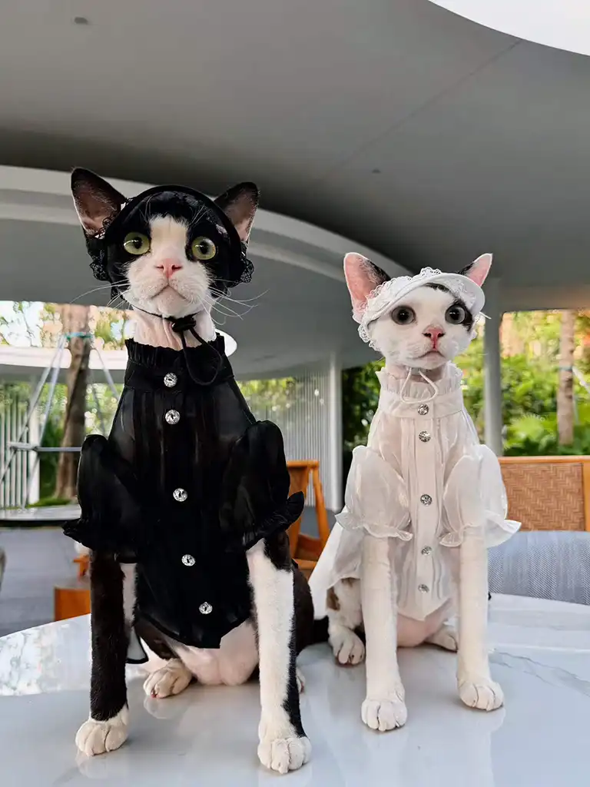
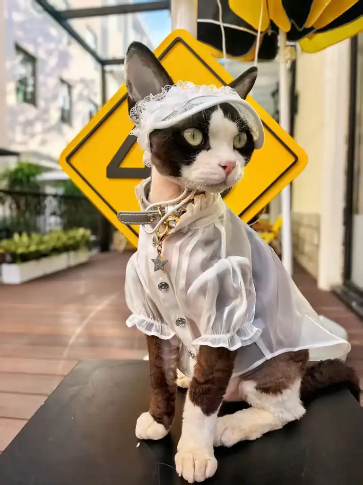
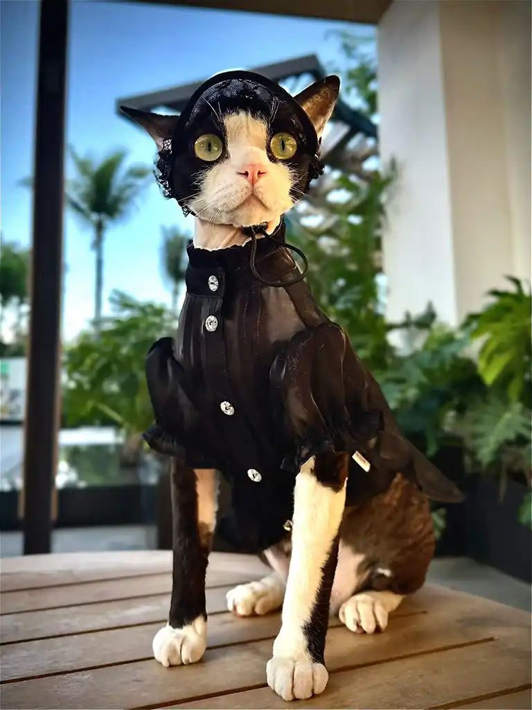
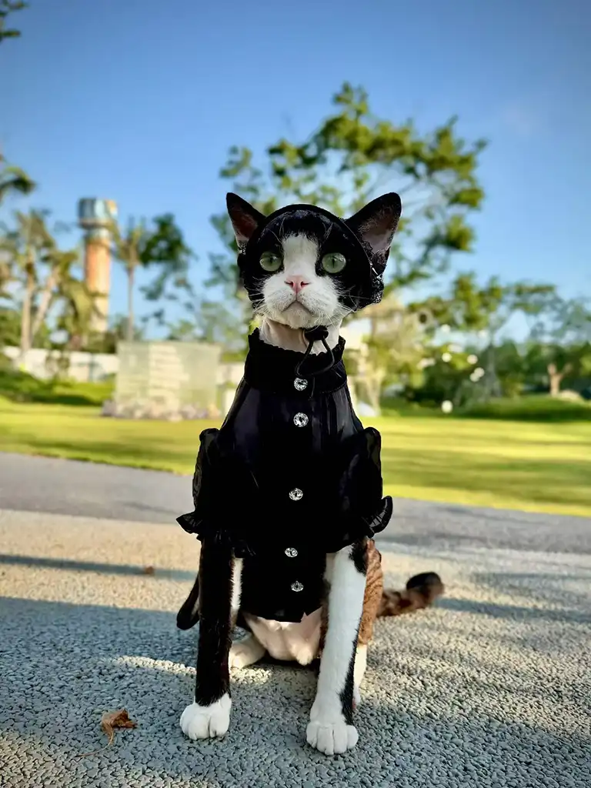

# Designer Cat Clothes: Youna's Original High-End Cat Fashion Collection

What if the "luxury" cat outfit you admired online was just a counterfeit logo stitched onto cheap polyester? For thousands of pet parents chasing **designer cat clothes**, that is the disappointing reality. The global luxury pet apparel market is now worth roughly $2 billion and growing at about 8% a year (CAGR), yet most of what gets labeled "designer" is either a mass-produced costume or a trademark-infringing knockoff of a human fashion house. Youna takes the opposite path: original, owned designs your cat can wear in comfort and you can wear with pride.

**What are designer cat clothes?** Designer cat clothes are original, brand-owned garments made for cats using premium fabrics and considered tailoring — not licensed knockoffs of human luxury labels. They prioritize a cat's comfort, safe fastenings, and a distinct aesthetic you won't see repeated on every feed.

You have probably scrolled past the same three cat costumes a hundred times — the tiny tuxedo, the monogram sweater, the sequined party dress. They are cute in a thumbnail and forgettable in person. We felt that gap too. You want something with design intent: clothes that photograph like *cat couture*, feel soft against fur, and read as a real collection rather than a costume drawer. In this guide we walk you through Youna's six original statement pieces, the fabrics and craft behind them, and exactly how to style, size, and safety-check them for your cat. We also explain why our work belongs in a different category from counterfeit "luxury." If you are building out a fuller setup, our [cat supplies range](../products/pet-supplies.html) pairs naturally with the looks below.

> **Key Takeaways**
> - Youna's collection is built on original designs across four themes — modern luxe, Victorian, garden, and gothic — with no trademark-infringing logos.
> - The line uses breathable, tactile fabrics (velvet, quilted satin, soft cotton blends, and lace) chosen for both look and feline comfort.
> - Six statement pieces span modern luxe to dark romance, each linked to its own product page.
> - Clothes are safe when you choose soft fabrics, easy-release fastenings, and supervise wear — especially for hairless breeds.
> - Correct sizing starts with chest girth, not weight; a simple four-step measure keeps the fit comfortable.

## Meet the Collection — Original Designer Cat Clothing, Not Counterfeit Luxury

When we say **cat couture**, we mean designs we actually own. That distinction sits at the heart of this collection. The pet-apparel internet is crowded with pieces that borrow — sometimes illegally — the names and monograms of human fashion houses. They look familiar in a thumbnail and feel hollow in the hand. Youna's answer is **original design cat clothes**: cohesive looks developed in-house across four themes, each with its own silhouette, fabric story, and styling logic.

Why does original design matter beyond legality? Because a real design language lets a collection hang together. A gothic dress and a Victorian gown can share a lace vocabulary while reading as two different moods. A silver quilted vest and a floral dress can alternate between modern-luxe and garden without clashing. The result is a wardrobe, not a pile of costumes — the kind of **designer cat clothes** you can build on piece by piece.

Consider what happened to Daniel, a cat owner in Lisbon. Last November he ordered a "designer" cat coat from a marketplace — a piece wearing a famous monogram. Within two wears the printed logo cracked and peeled, and the stiff synthetic lining left his tabby, Mochi, scratching at her sides. "It looked expensive in the photo and felt cheap on her back," he told us. He switched to Youna's original velvet waistcoat and never looked back. That arc — from borrowed logo to owned design — is exactly what this collection is built to prevent.

**Ready to see the looks?** [Explore the full six-piece designer cat clothes collection](#the-6-statement-pieces) and find the silhouette that fits your cat's personality.

## The 6 Statement Pieces

Six designs, six moods. Each piece below is an original Youna silhouette with its own fabric story, and each links to its dedicated product page where you can check colours, sizing, and care.

### Silver Quilted Vest Set — Modern Luxe

Clean lines, a lightly padded quilted satin front, and a minimal silver trim give this set its contemporary edge. It is the piece for the cat who suits a tailored, almost architectural look — sharp enough for a product launch photo, soft enough for a chilly evening indoors. The vest closes with an easy side fastening so dressing stays stress-free. Discover the [silver quilted vest set for cats](../products/cat-silver-quilted-vest.html) for the full spec, colour options, and size chart.

### White Victorian Gown — Regal Heritage

A floor-sweeping skirt, structured bodice, and delicate lace trim make this gown the collection's most formal statement. It reads like a miniature heirloom portrait — perfect for birthdays, holidays, and the kind of photo your friends save. The cotton-blend lining keeps the drama comfortable rather than costume-y, which is what separates a real **victorian cat dress** from a party prop.

See the [white Victorian gown for cats](../products/cat-white-victorian-gown.html) to view the lace detail up close and confirm the right size for your cat.

### Grey Velvet Waistcoat — Tactile Elegance

Velvet does something no other fabric quite manages: it reads as luxurious and feels forgiving. This waistcoat pairs a deep grey pile with a slim cut, so it photographs rich without bulk. It is a quiet flex — the piece you reach for when you want "elevated" rather than "theatrical." Explore the [grey velvet waistcoat for cats](../products/cat-grey-velvet-waistcoat.html) for fabric weight, lining notes, and sizing.

### Floral Garden Dress — Romantic Whimsy

Soft petals, a gathered waist, and a breezy skirt give this dress its garden-party charm. It is built for natural light and outdoor shoots among real flowers, where the print blends instead of competes. The lightweight weave keeps your cat cool during longer wear. View the [floral garden dress for cats](../products/cat-floral-garden-dress.html) to see the full bloom of the print and pick your size.

### Black Gothic Dress — Dark Romance

Sheer black layers, a dramatic lace hat, and a cinched waist make this the collection's moodiest piece. It is **gothic cat clothes** at their most refined — all shadow and lace, never costume. The breathable mesh means the drama does not come with overheating, so your cat stays composed through a whole shoot.

Step into the [black gothic dress for cats](../products/cat-black-gothic-dress.html) product page for the full detail shot and measurement guide.

### White Victorian Collar Dress — Refined Minimalism

Where the gown goes maximal, this collar dress goes quiet: a crisp white dress anchored by an ornate Victorian collar. It is the most versatile piece in the line — equally at home in a studio portrait or a casual weekend frame. See the [white Victorian collar dress for cats](../products/cat-white-victorian-collar-dress.html) for the collar construction and size options.

## The Fabrics & Craft Behind the Line

**What fabrics are best for cat clothes?** The best fabrics for cat clothes are soft, breathable, and low-irritation: cotton, jersey, velvet, and satin blends. Avoid stiff synthetics that trap heat or rub sensitive skin, and choose weaves that give a little as your cat moves.

Every piece in this collection starts from that principle. We reach for velvet when we want depth and a forgiving hand-feel. Quilted satin gives the silver vest its structure without weight. Lace is used as trim and overlay rather than a full layer, so it reads as detail, not constraint. For a casual, streetwear mood, the [silver quilted vest set](../products/cat-silver-quilted-vest.html) and grey waistcoat deliver the same everyday-cool energy a denim piece would — without the stiffness that rubs sensitive skin. (Denim remains a styling direction we may extend as a future Spoke; the current six pieces carry the look in softer fabrics.) None of it is chosen to look impressive on a mannequin and fail on a living cat.

The craft is in the cut as much as the cloth. Each garment is shaped to a cat's real anatomy — a narrow chest, a high waist, room at the shoulders. Seams are finished so they do not chafe, and fastenings are placed where paws cannot snag them. That is the quiet difference between **luxury cat clothes** and a costume: the inside matters as much as the outside. When you choose **high end cat clothes** or **premium cat clothes** from an original studio, you are also choosing a manufacturing discipline that treats the cat, not the camera, as the final judge.

## How to Style Your Cat for Photos & Special Occasions

The **best cat clothes for Instagram** are not the loudest — they are the ones matched to a setting. Treat each look like a small photo concept, and you will get **cat outfit ideas** that actually convert to saves.

- **Gothic → moody backdrop.** A dark wall, a single warm light, and the black gothic dress create instant atmosphere. Shoot slightly from above for a regal, brooding frame.
- **Victorian → vintage props.** A brass mirror, a velvet cushion, or an old book turns the white gown into a portrait. Soft window light flatters the lace.
- **Garden → natural light.** The floral dress belongs among real plants. Shoot in open shade so colours stay true and your cat stays cool.
- **Modern Luxe → street energy.** A sunny step, a relaxed pose, and the [silver quilted vest](../products/cat-silver-quilted-vest.html) or grey waistcoat read as everyday cool rather than a staged set — the same appeal a **cat denim outfit** brings, in a softer, cat-friendly fabric.

Here is a real example from our community — the gothic outdoor look:

When pet influencer @LunaTheFluff turned three this May, her owner Priya booked a small studio and dressed her in the black gothic dress with the lace hat. They kept the session to twelve minutes, used a single ring light, and let Luna wander between takes rather than holding her still. The resulting carousel earned over 40,000 likes and became Priya's most-saved post of the year. The lesson: match the outfit to the mood, keep sessions short, and let the cat lead.

A few universal tips: shoot in natural light whenever possible, capture the in-between moments rather than only posed frames, and echo your own outfit's palette so the two of you read as a pair. **Planning a shoot?** [Revisit our styling guide above](#how-to-style-your-cat-for-photos--special-occasions) whenever you need a theme refresher.

## Are Designer Cat Clothes Safe & Comfortable?

**Are clothes safe for cats?** Clothes are safe for cats when made from soft, breathable fabric with easy-release fastenings, worn for short supervised sessions. Always check for rubbing, overheating, or signs of stress, and remove the garment if your cat seems distressed.

Comfort starts with the fabric, which is why we avoid stiff, heat-trapping synthetics. But safety is also about the small things: fastenings that release if snagged, no dangling strings a cat could chew, and a fit that never restricts breathing or movement. If your cat wears a collar, pair outfits with [breakaway cat collars](../products/pet-collar.html) that release under pressure — the safest choice for any cat in clothing. This is the honest answer to "do cats like clothes": many tolerate and even seem to enjoy a well-made layer, but only when the garment respects their body.

Breed matters more than most people expect. Hairless cats like Sphynx feel the cold keenly; Mara, a Sphynx owner in Chicago, noticed her cat Nero shivering at 19°C indoors last January. A lightly padded vest changed his evenings — he tolerated it within a day and stopped seeking the radiator. Long-haired cats, by contrast, can overheat faster, so keep sessions brief and watch for panting. Even the finest **designer cat clothes** should never be forced; the goal is to offer warmth or style your cat accepts willingly.

> **What veterinarians advise.** Feline clinicians broadly recommend limiting cat clothing to short, supervised sessions and watching closely for overheating, rubbing, or stress — removing the garment at the first sign of distress. Hairless breeds may benefit from a light layer in cool rooms, while long-haired cats overheat faster and need briefer wear. When in doubt, let the cat's own body language decide.

Start with five minutes, watch body language, and build up only if your cat stays relaxed. A content cat makes a better photo than a restless one.

## Sizing & Fit: How to Measure Your Cat

A poor fit ruins even the best design — and the wrong size is the most common reason cats reject clothes. If you have wondered **how to measure a cat for clothes**, the fix is simpler than you think: measure before you buy.

1. **Measure chest girth.** Wrap a soft tape around the widest part of the rib cage, just behind the front legs. This is your primary fit number.
2. **Measure neck circumference.** Circle the base of the neck where a collar sits, leaving room for one finger.
3. **Measure back length.** From the base of the neck (where the shoulders meet) to the base of the tail.
4. **Check the chart by chest, not weight.** Weight alone is unreliable — chest girth predicts comfort far better.

| Size | Chest (cm) | Neck (cm) | Back (cm) | Weight guide |
|------|-----------|-----------|-----------|--------------|
| XS | 28–34 | 18–22 | 22–26 | 2–3 kg |
| S | 34–40 | 20–24 | 26–30 | 3–4 kg |
| M | 40–46 | 22–26 | 30–34 | 4–5 kg |
| L | 46–54 | 24–28 | 34–40 | 5–7 kg |

When a cat sits between sizes, size up — a touch of ease beats a restrictive squeeze. A great fit makes any **luxury cat clothes** purchase feel worth it, and each product page above links to its own size notes so you can confirm the specific cut before checkout.

## Caring for Designer Cat Clothes: Washing & Storage

A well-made cat outfit should survive more than one shoot. The good news: every fabric in this line is chosen to be washable, not delicate-to-the-point-of-useless. Follow five steps and your pieces stay photo-ready.

1. **Read the care note first.** Each product page lists its specific care line — velvet and sheer mesh, for example, differ slightly.
2. **Wash cold and gentle.** Hand wash in cold water, or use a gentle machine cycle inside a mesh laundry bag. Warm water and agitation fade satin and crush velvet pile.
3. **Reshape, never wring.** Smooth the garment — and any molded hat — back into shape while damp. Wringing the sheer gothic mesh or the quilted vest creases the structure permanently.
4. **Line dry away from heat.** Lay flat or hang to dry; keep velvet and satin off radiators and out of the tumble dryer, which dulls the finish and flattens pile.
5. **Store flat, refresh with steam.** Keep pieces flat in the OPP bag they ship in; a quick low-steam pass revives lace and velvet between wears.

For the berets, wide-brim, and lace hats, wipe rather than submerge so they hold their shape. A piece that lasts is what separates **luxury cat clothes** from a one-wear costume. Pair your looks with our [cat care accessories](../products/pet-supplies.html) to keep every piece photo-ready.

## Pricing, MOQ & Ordering (Wholesale)

Youna sells this collection as original-design wholesale: the same pieces boutiques, Amazon/Shopify sellers, and private-label brands resell under their own name. If you are weighing **designer cat clothes** as a product line, here is what to expect.

- **MOQ:** 200 pieces per colorway — enough to test a hero SKU, low enough to hold factory pricing.
- **Sample lead time:** 5–7 days for a pre-production sample you approve before any bulk run.
- **Bulk lead time:** 12–20 days after sample sign-off, so a typical reorder lands within about a month.
- **Customization:** woven logo tags, custom colours, and custom trims are available at MOQ — useful for a private-label line.
- **Factory pricing:** quoted per order against your spec; confirm the exact per-piece figure with the team when you request a sample.

For retail context, premium cat apparel from established brands typically lands in a roughly $29–$75 band, with statement gowns and gothic sets at the upper end. Youna's original pieces sit in that premium tier, but the wholesale factory price is what protects your margin — the real reason to source original rather than resell a trademark-risky knockoff.

## Orders, Samples & Returns

Because each run is made to your approved sample, the safest buying path is sample-first. You review the pre-production piece — fit, fabric, trim — in 5–7 days, then we proceed to bulk only after you sign off, so the 200-piece order matches what you approved. For private-label and custom-colour work, confirm the artwork and spec in writing before production.

If something arrives outside spec or is damaged in transit, contact the Youna team with photos and your order reference; we resolve issues per the terms on your order confirmation. Made-to-order custom pieces generally cannot be returned once bulk production has begun — which is exactly why the sample step matters, as it is your checkpoint before commitment.

## The Perfect Gift for Cat Lovers

Few gifts land like something made for a beloved pet. A Youna piece turns a birthday, adoption anniversary, or holiday into a moment worth photographing — and it is the rare present the recipient will actually use. For the pet influencer in your life, a single statement outfit can anchor a whole content week. For a first-time cat parent, a versatile piece like the collar dress is an easy, flattering starting point. **Designer cat clothes** make especially thoughtful gifts because they combine novelty with genuine usefulness.

If you are assembling a larger surprise, our [complete pet supplies collection](../products/pet-supplies.html) rounds out the gift with practical extras that pair naturally with the clothing. Wrap the box, add a note about the design story, and you have given more than an outfit — you have given a shared experience.

## Why Choose Youna Original Design

The short answer: we own what we make. Where much of the market leans on borrowed logos or generic costumes, Youna builds **luxury cat clothes** from original designs developed in-house. That means no trademark risk, a consistent aesthetic across the collection, and a brand story you can stand behind. It is also why we describe our work as **original design cat clothes** rather than another brand's knockoff.

It also means manufacturing discipline. Our apparel background shows in the finishing — clean seams, considered fastenings, fabrics chosen for feline comfort as much as visual impact. You are not buying a logo; you are buying a garment engineered for a cat. For pet parents tired of the same three costumes and the disappointment of a peeling knockoff, **designer cat clothes** from an original studio are the quieter, better investment.

## Conclusion

Youna's original high-end cat fashion collection proves that **designer cat clothes** can be both beautiful and genuinely cat-friendly. Six statement pieces — from the silver quilted vest to the white Victorian collar dress — give you a real wardrobe across modern-luxe, Victorian, garden, and gothic themes. Behind every look sits breathable fabric, considered tailoring, and a safety-first mindset.

Ready to dress your cat in something original? Here is where to go next:

- **View the full collection.** Explore all six original pieces and pick your cat's statement look: the [silver quilted vest set for cats](../products/cat-silver-quilted-vest.html), [white Victorian gown for cats](../products/cat-white-victorian-gown.html), [grey velvet waistcoat for cats](../products/cat-grey-velvet-waistcoat.html), [floral garden dress for cats](../products/cat-floral-garden-dress.html), [black gothic dress for cats](../products/cat-black-gothic-dress.html), and [white Victorian collar dress for cats](../products/cat-white-victorian-collar-dress.html).
- **Revisit the styling guide** above whenever you plan a shoot or special occasion — theme-by-theme ideas are waiting in the [How to Style section](#how-to-style-your-cat-for-photos--special-occasions).
- **Contact the Youna team** with any sizing or custom questions — we are happy to help you find the perfect fit.

Your cat deserves clothes designed for them, not borrowed from someone else. Start with one piece, and see how original design changes the whole frame.

---
Meta Title: Designer Cat Clothes: Youna's High-End Cat Fashion
Meta Description: Discover Youna's original designer cat clothes — gothic, Victorian & modern-luxe looks in velvet, satin & lace. Styling tips, sizing, care and a safe-fit guide inside.
Primary Keyword: designer cat clothes
Secondary Keywords: luxury cat clothes, high end cat clothes, cat couture, gothic cat clothes
URL Slug: /blog/designer-cat-clothes-collection
Word Count: ~3,450
