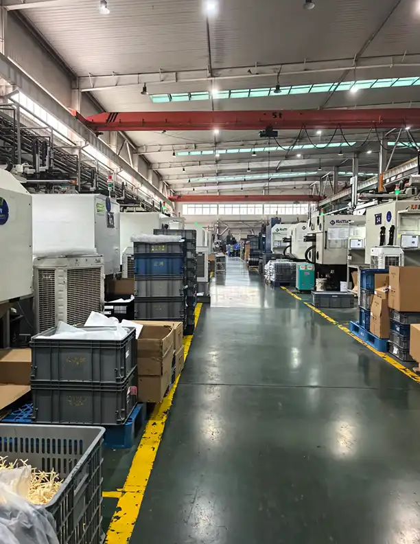
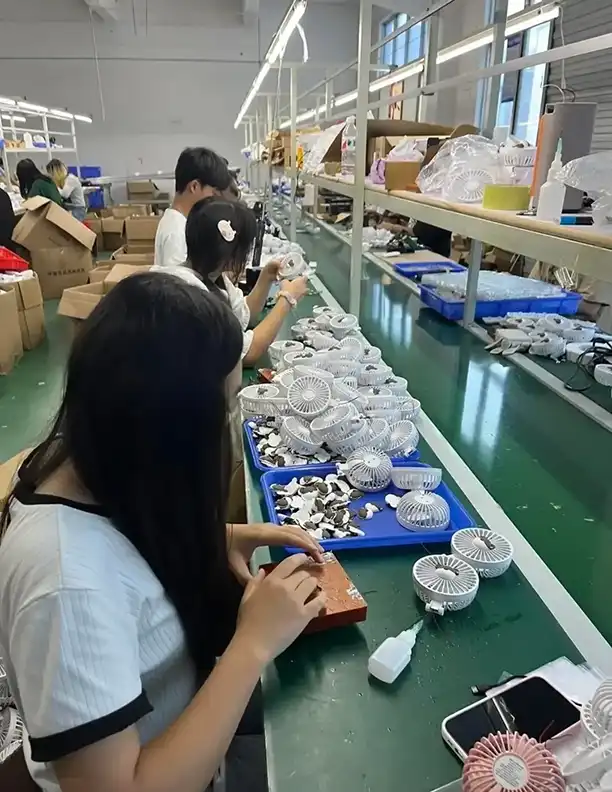
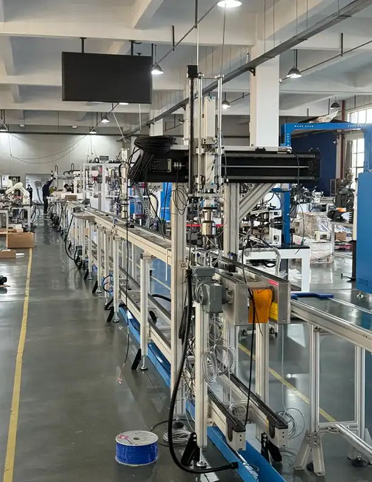
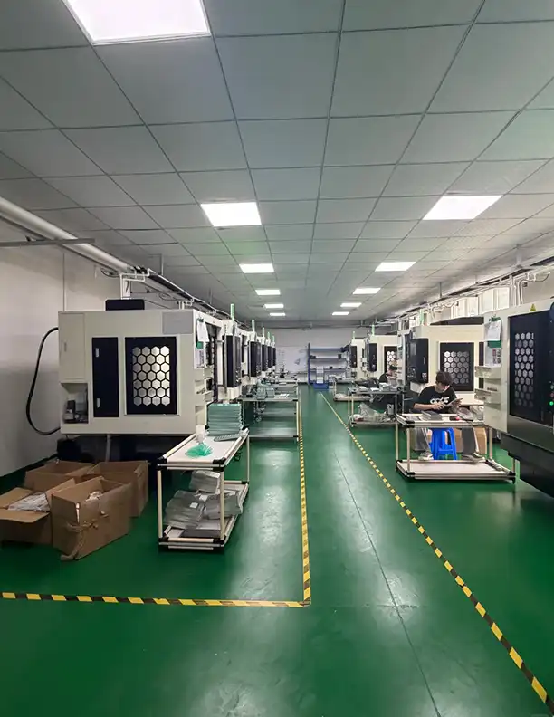
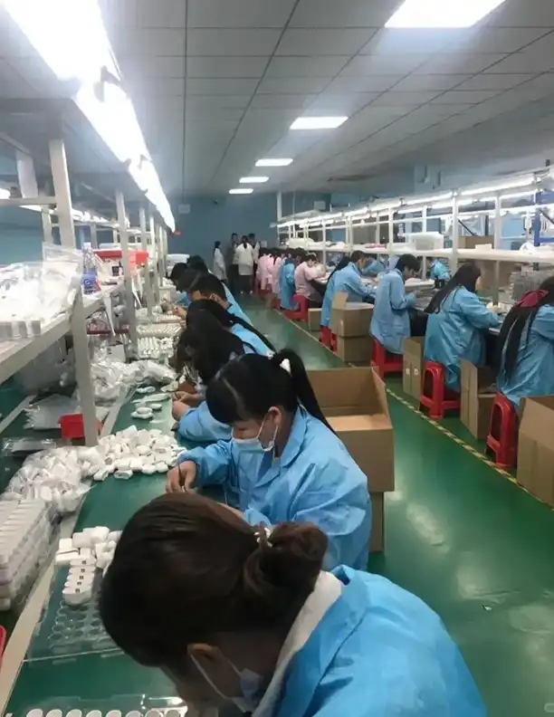

# How to Get Factory-Direct Pricing from Chinese Suppliers (2026 Guide)

*By Youna Global — Sourcing from Guangdong, China*

---

Every importer wants the same thing: **factory-direct pricing**. Cut out the middleman, pay what the manufacturer actually charges, and keep the difference as margin.

But here is what almost nobody tells you before they take your money: **the factory already has multiple price tiers, and the one they show you first is almost never their best one.**

Chinese manufacturers quote new overseas buyers 15–30% above what their regular domestic or long-term buyers pay. It is not a scam. It is a risk buffer — factories assume you will change specifications three times, push back on quality after production starts, and need more hand-holding than a buyer who has been ordering from them for three years. They are often right.

The good news: once you understand how factory pricing actually works, you can move from the "new buyer" column to the "preferred partner" column faster than most importers think possible. And it does not require being aggressive, loud, or culturally tone-deaf. It requires preparation, leverage, and knowing which levers to pull.

We walk these floors every week. Here is what we have learned about getting real factory-direct prices in 2026 — complete with photos from actual production lines we visit regularly.

<figure class="article-figure">

<figcaption>A CNC machining facility in Guangdong. Factory-direct pricing means your money goes to equipment like this, skilled operators, and materials — not to a middleman's markup. We photograph floors like this on every supplier verification visit.</figcaption>
</figure>

## Why Factories Quote You More Than Their Regular Buyers

The first price you receive from a Chinese manufacturer includes what seasoned buyers call the **"foreigner tax"** — an intentional padding of 15–30% above the price the factory offers to its established domestic or repeat international accounts.

This is not unique to China. Manufacturing cultures across most of Asia build negotiation room into opening quotes because they expect you to push back. The difference is that **new overseas buyers signal inexperience in ways that trigger even higher padding**:

- Vague or changing specifications (the #1 red flag)
- Small initial order quantities with no growth story
- Demanding payment terms on the first interaction
- Aggressive "your price is too high" language without data
- Skipping written proforma agreements

A domestic Chinese buyer who orders 5,000 units every quarter, pays on time, and never changes specs after sample approval? That buyer gets a different price sheet. Sometimes literally a separate internal column labeled "regular price" versus "sample price."

The gap between those two columns is what this article helps you close.

### What Goes Into a Real Factory Price (2026 Data)

To negotiate intelligently, you need to understand what you are negotiating *about*. Multiple sourcing agencies and cost analysts publish roughly the same breakdown for consumer goods manufactured in coastal China:

| Cost Component | Typical Range | Notes |
|----------------|---------------|-------|
| Raw materials | 40–60% (up to 70% for hardware) | Plastic resin up ~50% since 2020; aluminum still elevated post-COVID |
| Labor & assembly | 15–25% | Guangdong base assembly: RMB 2,300–2,800/mo (~$600–900 all-in); skilled CNC/operators: RMB 6,000–7,000/mo (~$1,000) |
| Tooling / mold / engineering | Amortized per unit | Often quoted separately; negotiable on volume commitment |
| Overhead (utilities, rent, QC, compliance) | 10–15% | Electricity up ~15% in Guangdong for carbon targets (2026) |
| Factory profit margin | 8–18% (genuine manufacturer) | Trading companies add 15–30% on TOP of this |
| VAT export rebate | −10 to −13% | Factored into FOB quotes; rebate rate varies by HS code |

These percentages mean there **is** a genuine floor below which a factory cannot go without cutting material quality, skipping certifications, or losing money. Your job as a buyer is to find where that floor is — and to recognize when a quote has wandered so far below it that something is wrong.

<figure class="article-figure">

<figcaption>Assembly line in Zhongshan producing portable fans. Labor cost — the people you see here, their time and skill — typically represents 15-25% of a factory's unit price for assembled products. Understanding this range keeps your expectations realistic.</figcaption>
</figure>

## Step-by-Step: How to Negotiate Factory-Direct Pricing

### Step 1: Benchmark With 3–5 Competing Quotes (Same Spec, Same Incoterm)

The single most powerful thing you can do before negotiating is **never negotiate against a single quote**. Approach at least three to five verified factories for the identical specification, packaged the same way, quoted on the same Incoterm (usually FOB).

The spread between the highest and lowest quote is your negotiating room. More importantly, having competing quotes gives you something that no amount of haggling can replace: **legitimate leverage**. When you tell a supplier, "I have received comparable quotes in the $X to $Y range," you are not bluffing. You are describing reality.

**What your RFQ must include to get comparable quotes:**
- Exact material grade or spec (Pantone reference for color, thickness/weight for raw materials)
- Dimensional tolerances
- Packaging requirements (individual polybag, export carton, custom retail box?)
- Certification requirements (CE, FCC, FDA, REACH — whatever applies)
- Volume tiers: request pricing at minimum MOQ, 2× MOQ, and 5× MOQ
- Target market destination (affects compliance requirements)

Vague RFQs produce vague quotes — and vague quotes make comparison impossible, which means negotiation becomes guesswork.

### Step 2: Lock Specification and Quality Standard BEFORE Discussing Price

This is the mistake that costs importers more than any other: **negotiating price before the product definition is locked.**

Here is what happens when you do that: you squeeze the factory on unit price, they agree (or appear to), and then they quietly downgrade material grade, switch to a cheaper packaging supplier, or relax their internal AQL inspection standard to protect their margin. You get a lower number on paper and a higher defect rate in the container.

The correct sequence:
1. **Agree on exact spec** (material, dimensions, tolerance, certifications, packaging) in writing
2. **Agree on quality standard** ("We inspect to AQL 2.5, major defects = fail")
3. **THEN** negotiate price against that fixed spec-and-quality baseline

If a factory cannot hit your target price at the agreed spec, you have two honest options: adjust the spec downward together, or accept that this factory's genuine floor is above your budget. Both are better than getting a fake low price on a phantom product.

### Step 3: Unbundle the Quote — Negotiate Each Line Separately

A single FOB price bundles multiple cost centers: raw material, labor, tooling, packaging, local logistics, inspection, and profit margin. Skilled negotiators break that bundle apart and address each line individually.

**Ask the factory for a detailed breakdown:**
- EXW price (ex-works, excludes their logistics markup) vs. FOB
- Material cost per unit (what drives this? can we use an alternative grade?)
- Tooling / mold cost (one-time? amortized? refundable on reorder?)
- Packaging cost (can you supply your own? simplify to reduce?)
- Inspection fee (included? third-party available?)

Tooling fees are frequently negotiable — many factories will absorb or amortize mold costs for buyers who commit to sufficient volume. Packaging is almost always overpriced in initial quotes; factories outsource printing and boxes to small shops with their own margins layered on top.

<figure class="article-figure">

<figcaption>Automated production line in Guangdong. At scale, automation dramatically reduces per-unit labor cost — but factories only invest in setups like this when they see consistent volume. Use your volume commitment as your strongest pricing lever.</figcaption>
</figure>

### Step 4: Lead With Volume and Repeat-Order Commitment

Factories price based on annual throughput, not a single purchase order. This is why the most effective negotiation openers are not "Can you lower the price?" but **"Here is how much we plan to buy over the next 12 months."**

Even if your first order is modest (500–1,000 units), frame it honestly as the beginning of a program:
> "This first order is 1,000 units. If quality meets our standards, we project 12,000–15,000 units over the next 12 months across 3–4 reorders. What is your best price for a buyer at that volume level?"

A credible repeat-order commitment typically moves unit price further than aggressive haggling on a single shipment ever will. Factories prioritize steady capacity utilization over maximizing profit on one transaction.

**Volume-tier pricing request template:**
> Please provide tiered pricing at the following quantities:
> - Trial order: [X] units
> - Standard reorder: [Y] units  
> - Annual commit: [Z] units
> 
> Also confirm: does unit price improve at each tier? By approximately how much?

### Step 5: Trade Concessions — Never Give Something for Nothing

Effective negotiation is an exchange, not a demand. Every concession you request should be paired with one you offer. This keeps the factory's margin intact while lowering your total landed cost:

| You Request | You Offer in Return |
|-------------|-------------------|
| Lower unit price | Larger deposit (50% vs 30%) |
| Lower MOQ | Higher unit price on trial order |
| Better payment terms (net 30) | Longer lead time window |
| Free/reduced tooling | Commitment to X reorders within Y months |
| Custom packaging at base price | You supply artwork within 48 hours |

Another powerful tactic for recurring orders: **split your volume across two vetted factories**. Placing orders with two suppliers removes single-source risk, keeps both competitive on price and quality, and gives you a live benchmark every time you reorder. The ability to shift volume is the strongest long-term lever you have.

<figure class="article-figure">

<figcaption>CNC machining workshop in Guangdong. Equipment like this represents major capital investment — depreciation, maintenance, electricity, and skilled operator time are fixed costs that do not disappear regardless of volume. This is why there IS a genuine price floor, and quotes that fall far below it are danger signals, not bargains.</figcaption>
</figure>

## Red Flags: When a "Great Price" Is Actually a Trap

Not every low quote is a win. Some are bait — and the gap between an attractive-looking price and reality gets filled with inferior materials, skipped certifications, subcontracted work to unlicensed workshops, or straight-up fraud after your deposit clears.

**Walk away (or investigate heavily) when you see these signals:**

- **Quote is 30–40%+ below the market average** for comparable specs. The math does not work unless someone is cutting corners somewhere critical.
- **They agree to everything immediately** without pushing back on specs, timelines, or trade terms. Real factories with real capacity push back because they know what their constraints are.
- **MOQ is suspiciously flexible** — "We can do 100 units or 10,000 units, same unit price!" That is a trading company signal, not a factory.
- **Payment terms demand 60–70%+ upfront before production starts.** Standard is 30% deposit, 70% before shipment (or after inspection). High upfront demands sometimes indicate the factory needs your cash to finish someone else's order.
- **Lead time is impossibly fast** for the quantity and customization level. "Two weeks for tooling plus 1,000 customized units" usually means either they are lying about the timeline or planning to cut every corner on quality.
- **No willingness to provide a detailed price breakdown** or factory credentials (business license, audit reports, client references).

What happens when you ignore these signs? The pattern repeats across hundreds of import deals annually: a buyer chases the lowest quote, skips third-party inspection to "save money," receives a container with 15–25% defect rate, spends more on rush replacements and returns than they "saved," and misses their selling season entirely. The cheapest quote often costs the most.

<figure class="article-figure">

<figcaption>Quality control and precision assembly line in Guangdong. Factories that quote too low to be profitable are frequently the same ones that skip steps like this — and you will not discover the problem until 20% of your order arrives defective, or worse, until customer reviews start appearing.</figcaption>
</figure>

## A Buyer Who Chased the Lowest Quote (And What It Actually Cost)

We cannot name specific clients, but we see versions of this story regularly:

A US-based importer sourced small electronic accessories from China. They requested quotes from four suppliers. Three came back between $4.20 and $4.80 per unit FOB for 2,000 pieces. The fourth offered $3.50 — nearly 25% below the next-lowest.

They took the $3.50 quote. No site visit. No third-party inspection (to save $400 in inspection fees). Deposit paid. Production started.

What arrived eight weeks later: 18% of units failed basic function test. Another 8% had cosmetic defects (misaligned printing, scratched housings). The factory blamed "shipping damage" and offered a 5% credit on the next order — which the importer had no intention of placing.

Real math on that deal:

| Item | "Expensive" Factory ($4.60 avg) | "Cheap" Factory ($3.50) |
|------|-----------------------------------|------------------------|
| Order cost (2,000 units) | $9,200 | $7,000 |
| QC inspection | $400 | Skipped |
| Defect replacement | $200 (2% rate) | $3,240 (18% + rework) |
| Customer returns | ~$100 | ~$1,400 |
| Time spent managing crisis | Minimal | ~80 hours @ ~$50/hr = $4,000 |
| **Total real cost** | **$9,900** | **$15,640** |

The "$1,700 savings" became a **$5,700 loss**. The lesson is not complicated: verify before you balance-pay. A fair price from a verified factory that lets you inspect before final payment beats a miracle quote from an unknown supplier every single time.

(For the full picture on hidden landed costs beyond the factory gate, read our guide to [the hidden costs of importing from China](blog-hidden-costs-importing-china.html).)

## New Buyer vs. Repeat Buyer: Your Negotiation Playbook

Where you sit on the buyer-spectrum determines which tactics work best:

| Factor | New Buyer (First Order) | Repeat Buyer (2+ Orders, Good Track Record) |
|--------|--------------------------|------------------------------------------|
| Typical discount from list price | 5–10% | 15–25% |
| Payment terms | 30/70 T/T (standard) | 30/70 T/T or net 30 days (earned) |
| MOQ flexibility | Limited (factory manages risk) | High (you have proven reliability) |
| Price transparency | Padded ("foreigner tax") | Near-actual manufacturing cost |
| Primary leverage | Volume commitment + competing quotes | Volume + relationship + history + split-supplier option |
| Factory behavior | Cautious; may pad lead time | Prioritized; expedited when needed |

**Your goal by order 3 or 4:** graduate from the "new buyer" column to the "repeat buyer" column. Pay on time. Do not change specs after sample approval. Communicate clearly and consistently. These sound like basic courtesies — and they are — but in an industry where flaky overseas buyers are the norm, consistency is a competitive advantage that translates directly into better pricing.

If you are not comfortable negotiating directly in this cultural context, or if you want someone who physically walks these floors to handle it on your behalf, [our sourcing services](services.html) include exactly this: supplier verification, price validation, production monitoring, and pre-shipment QC — all from our base in Guangdong.

## Frequently Asked Questions

### Can I really get the same price as domestic Chinese buyers?

Almost, but not quite. Domestic buyers benefit from no language barrier, no currency conversion risk, no export logistics, and often decades of existing relationships. As an overseas buyer, your realistic target is **within 5–10% of domestic buyer pricing** once you have placed 2–3 successful orders and built trust. That is a massive improvement over the 15–30% "foreigner tax" on opening quotes.

### What is a reasonable counter-offer percentage?

For a first-time counter-offer on a genuine factory quote, **10–15% below their stated price** is standard and expected. Support it with data: competing quote ranges, volume commitment, or simplified packaging. Avoid opening at 30%+ below — that signals either that you do not understand real manufacturing costs or that you are not a serious buyer, both of which damage your position.

### Should I visit the factory before negotiating?

A visit is valuable — factories routinely offer their best prices to buyers who show up in person because it demonstrates seriousness and builds guanxi (relationship). But a visit is not mandatory for good pricing. If you cannot travel, hiring a local sourcing agent who visits on your behalf achieves much of the same effect: the factory knows someone is watching, and that alone changes how they quote.

### How do I know if I am talking to a factory or a trading company?

Request their business license (it will say "manufacturing scope" or "trading scope"), ask for on-site production photos (not just product shots), and check whether their product range is implausibly wide (a real factory typically specializes in 1–3 product categories; a trading company sells everything). For a deeper dive, read our guide to [telling trading companies from manufacturers in 5 minutes](blog-trading-company-or-manufacturer-china.html).

### What if the factory refuses to give a detailed price breakdown?

That is itself a signal. Legitimate factories with nothing to hide can and will break down material, labor, and overhead costs — at least approximately. A flat refusal suggests either a trading company reselling at a markup they do not want you to see, or a factory quoting artificially low and afraid scrutiny will expose it. In either case, treat it as a yellow flag and get a second opinion from another supplier.

---

## Bottom Line

Getting factory-direct pricing from Chinese suppliers is not about being the toughest negotiator in the room. It is about being the **most prepared**: understanding real cost structures, benchmarking against multiple sources, leading with volume instead of haggling, locking quality standards before prices, and recognizing when a cheap quote is a trap dressed up as a bargain.

The factories that survive in Guangdong in 2026 are not desperate. Competition has thinned since 2018 — weaker players have exited, and the ones remaining charge fair prices for quality work. Your job is to prove you are the kind of buyer worth giving that fair price to.

**Unsure whether a quote is fair? Send it to us.** We break down pricing against real Guangdong factory costs every day — material rates, labor benchmarks, equipment depreciation — and we tell you honestly whether the number makes sense or whether you should keep looking. No obligation, no pressure.

[**Get a free quote review → Contact us on WhatsApp (+86 19898484442)**](https://wa.me/861989844442) or [email us at longxin3639@gmail.com](mailto:longxin3639@gmail.com)

**Ready to source with someone who walks these floors weekly?** [See our full service offering](services.html) — from supplier verification to pre-shipment QC, we handle the hard parts so you get factory-direct pricing without the learning curve.
